# LunaLog - Personal Wellness & Daily Journal

## Purpose

LunaLog is a space to track your daily life, how you feel daily and are you even improving or not.
Instead of using multiple apps you will get mood tracker, sleep tracker, habit tracker and last but not least Daily journal in one place\

There are already a lot of habit trackers and journaling apps out there, but most of them are either:

1. too complicated
2. locked behind logins/subscriptions

This project focuses on being simple, fast, and actually useful daily.

## Tech Stack

- HTML5
- CSS3
- Javascript(Vanilla)
- LocalStorage

## How to Use

1. Open the project
   - Just open `index.html` in your browser(if you wan it locally on your device)
     else there is a live link

2. Start tracking
   - Select your mood daily
   - Add habits and mark them complete
   - Log your sleep
   - Write journal entries

3. Check insights
   - Go to insights page to see patterns and stats

4. Use journal
   - Write entries
   - Edit or delete anytime
   - Expand long entries using "Read More"

5. Switch theme
   - Toggle dark mode anytime

## Screenshots

1. Home
   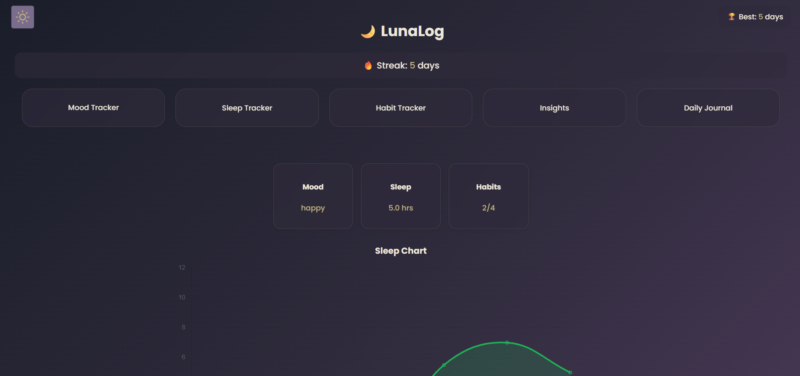
   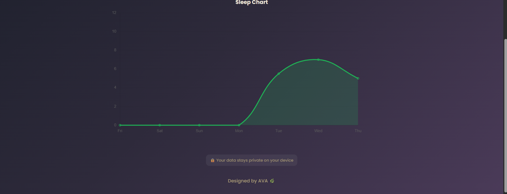

2. Mood Tracker
   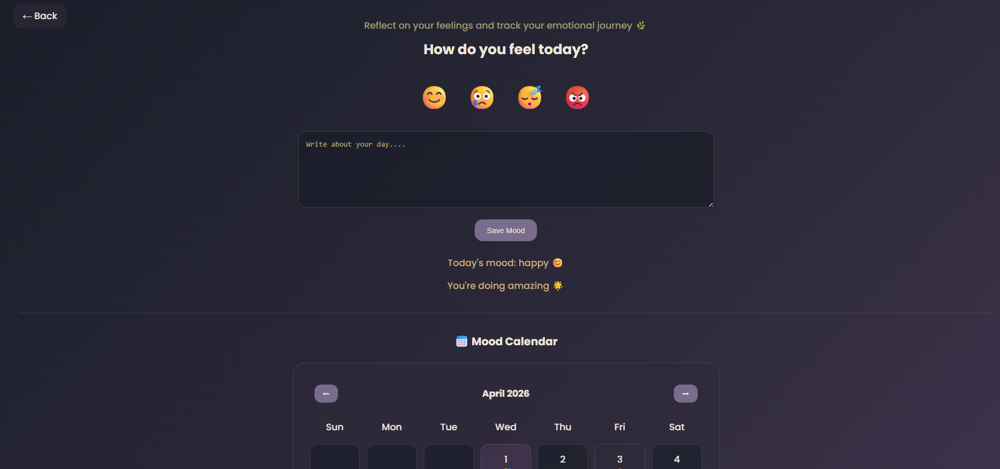
   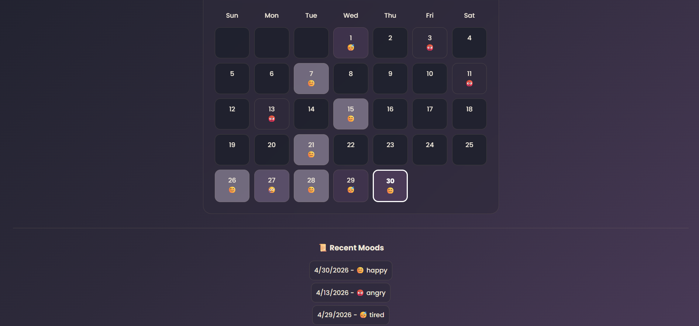

3. Sleep Tracker
   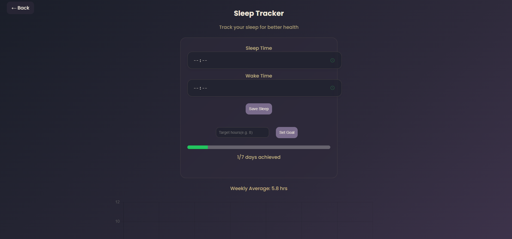
   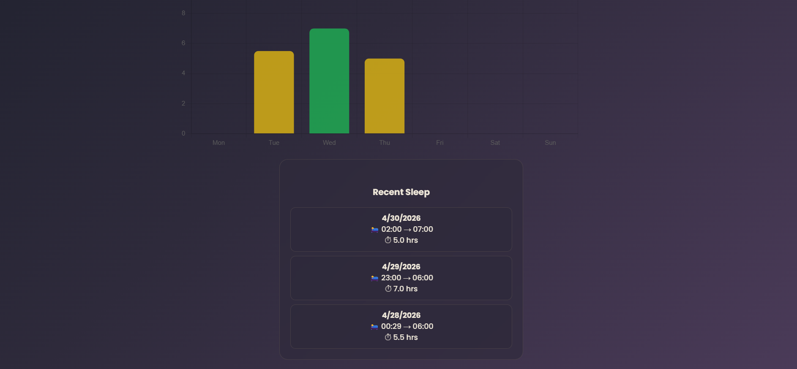

4. Habit Tracker
   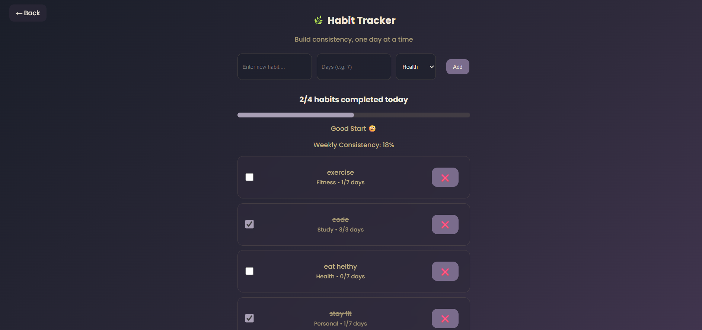
   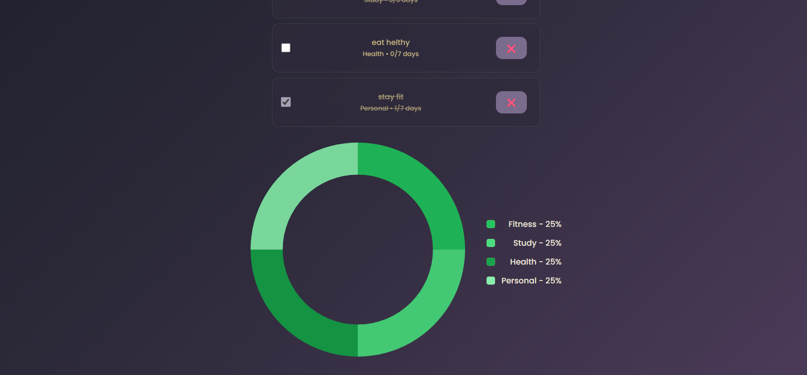

5. insights
   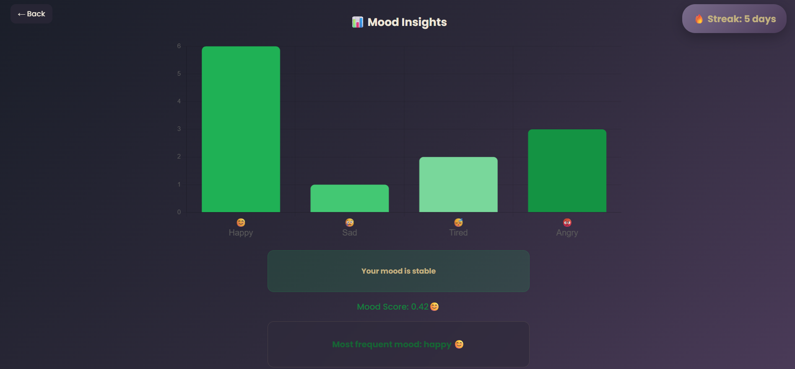

6. Daily Journal
   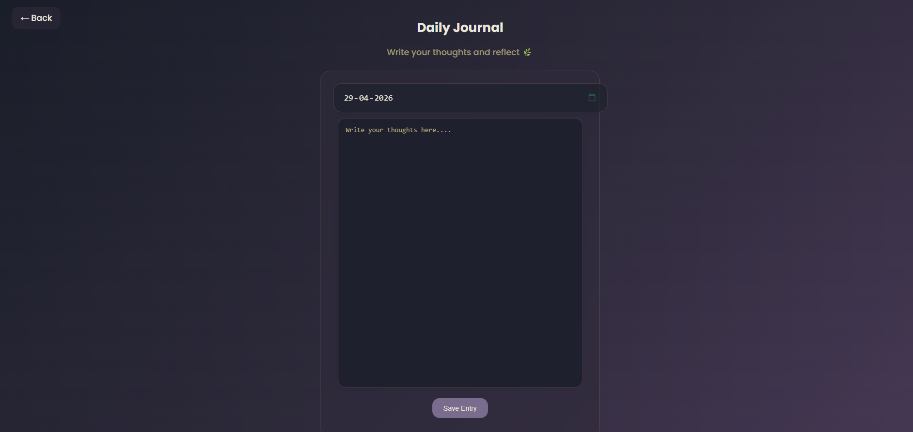
   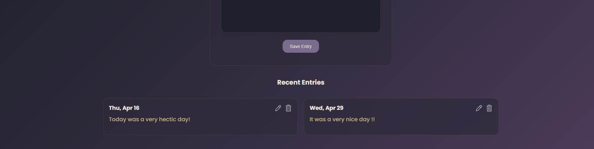

7. Light Mode
   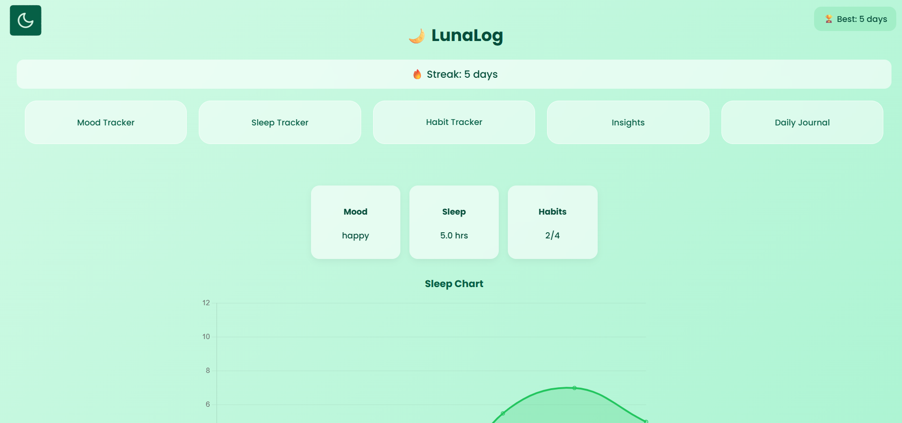

## Notes

1. All data is stored in your browser using LocalStorage
2. Clearing browser data will remove everything
3. No login required

## All emojis are taken from emojipedia.org

## MADE BY AVA
